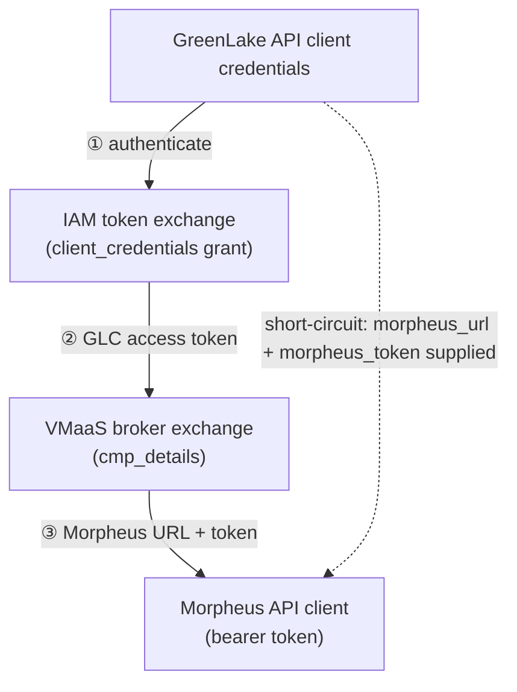

# greenlake/cloud/sdk

SDK packages specific to the `greenlake_cloud` provider. For SDK code shared
across GreenLake providers, see `greenlake/sdk` instead.

## Layout

- `vmaascmp/` — Go SDK for the VMaaS-CMP (Morpheus) API, including the VMaaS
  broker client used during authentication.

## Auth flow

The `greenlake_cloud` provider turns GreenLake API-client credentials into a
usable **Morpheus URL and bearer token** via a two-legged exchange:

1. **IAM token exchange** — handled by the shared token SDK at
   `greenlake/sdk/token` (IAM-version-agnostic; serves both GLCS and GLP).
2. **Broker exchange** — the `vmaascmp` broker client trades the IAM token for
   Morpheus connection details (`cmp_details`).
3. **Morpheus client** — the URL and token are used to talk to Morpheus directly.

If a Morpheus URL and token are supplied directly, both exchanges are skipped.

## Status

Not yet wired into `cloud.Provider.Configure`; the provider schema and the call
site that builds the Morpheus client from the exchange result are still to be
added.
