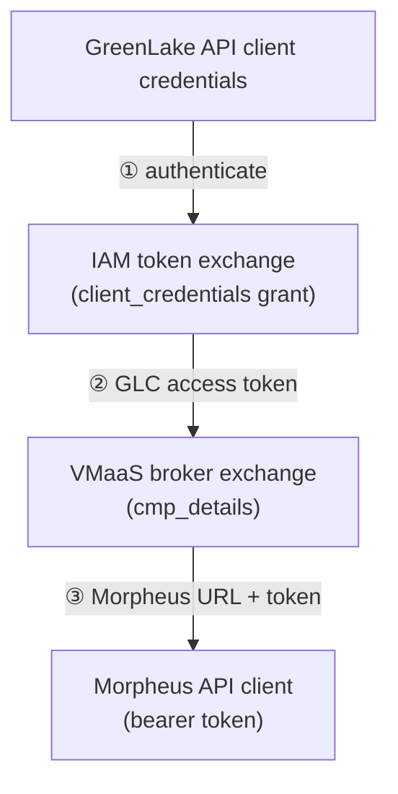

# morpheus/pce/connected/sdk

SDK packages specific to Connected PCE. For SDK code shared across
PCE deployment types, see `morpheus/pce/sdk` instead.

## Layout

- `vmaascmp/` — Go SDK for the VMaaS-CMP (Morpheus) API, including the VMaaS
  broker client used during authentication.

## Auth flow

A `pce_identity` block on the `morpheus` provider turns GreenLake
API-client credentials into a usable **Morpheus URL and bearer token** via a
two-legged exchange:

1. **IAM token exchange** — handled by the shared token SDK at
   `morpheus/pce/sdk/token` (IAM-version-agnostic; serves both GLCS and GLP).
2. **Broker exchange** — the `vmaascmp` broker client trades the IAM token for
   Morpheus connection details (`cmp_details`).
3. **Morpheus client** — the URL and token populate the Morpheus provider
   configuration, and the usual client factory takes over from there.

If `url` and `access_token` are set on the `morpheus` block directly, no
`pce_identity` block is needed and both exchanges are skipped.

## Status

Wired into `morpheus.Configure` via `pceIdentityTokenExchange`. The
access token returned by the broker is used as-is and is not refreshed, so work
must complete within the token's validity period.
