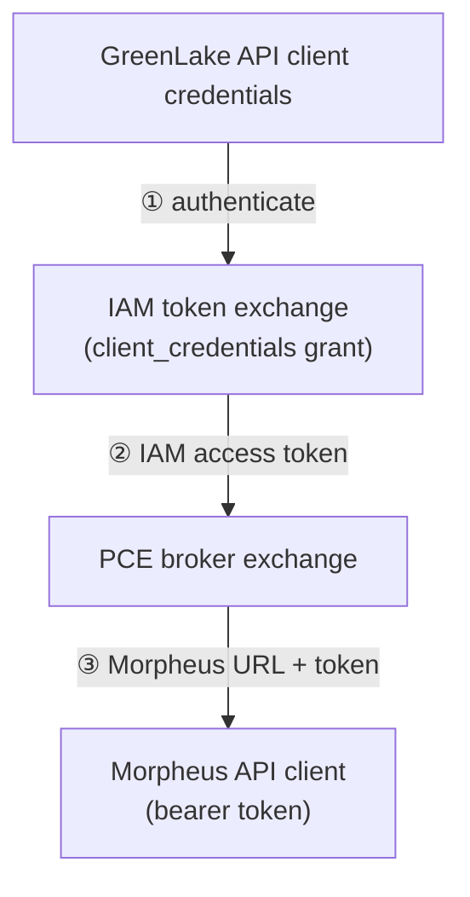

# morpheus/pce/sdk

Common SDK packages shared across PCE deployment types (Connected PCE and
Disconnected PCE).

Code here is deployment-agnostic: it implements the low-level GreenLake platform
integrations — authentication, token exchange, and related clients — that more
than one deployment type may need. Deployment-specific wiring (schema handling,
`Configure`, token exchange) lives with the Morpheus provider, not here.

## Layout

- `token/` — GreenLake IAM token generation and automatic refresh. The
  client is IAM-version-agnostic (callers pass the version at call time), so it
  serves both GLCS and GLP token exchanges.
- `broker/` — PCE broker client. Trades an IAM token for Morpheus connection
  details. The same client serves both deployment types: Connected PCE uses the
  HPE-hosted broker, Disconnected PCE an operator-supplied broker URL.

## Auth flow

A `pce_identity` or `pce_disconnected_identity` block on the `morpheus` provider
turns GreenLake API-client credentials into a usable **Morpheus URL and bearer
token** via a two-legged exchange:

1. **IAM token exchange** — handled by `token/`, which serves both GLCS
   (Connected) and GLP (Disconnected).
2. **Broker exchange** — `broker/` trades the IAM token for Morpheus connection
   details.
3. **Morpheus client** — the URL and token populate the Morpheus provider
   configuration, and the usual client factory takes over from there.

The two deployment types differ only in the IAM dialect and how the request is
scoped:

| | Connected (`pce_identity`) | Disconnected (`pce_disconnected_identity`) |
|---|---|---|
| IAM version | GLCS | GLP |
| Broker scope | `?space=` | `?tenantID=` + `X-Tenant-ID` header |
| Broker URL | defaulted to the HPE-hosted broker | required; on-premise |

If `url` and `access_token` are set on the `morpheus` block directly, no identity
block is needed and both exchanges are skipped.

## Guidelines

- Keep packages here free of deployment-specific assumptions so any PCE
  deployment type can depend on them.
- Prefer adding shared, reusable integrations here rather than duplicating them
  inside individual deployment types.

## Status

Wired into `morpheus.Configure` via `pceIdentityTokenExchange`. The access token
returned by the broker is used as-is and is not refreshed, so work must complete
within the token's validity period.

The exchange is not cached. The `hpe` provider muxes a framework provider and an
SDKv2 provider and Terraform configures both, so a configuration using an
identity block exchanges once per provider.

Whether a repeated exchange returns the same Morpheus token or a new one is up
to the broker, and is not relied on here. Either is safe: issuing a token does
not invalidate one already issued, so the two providers cannot disturb each
other's credentials.
